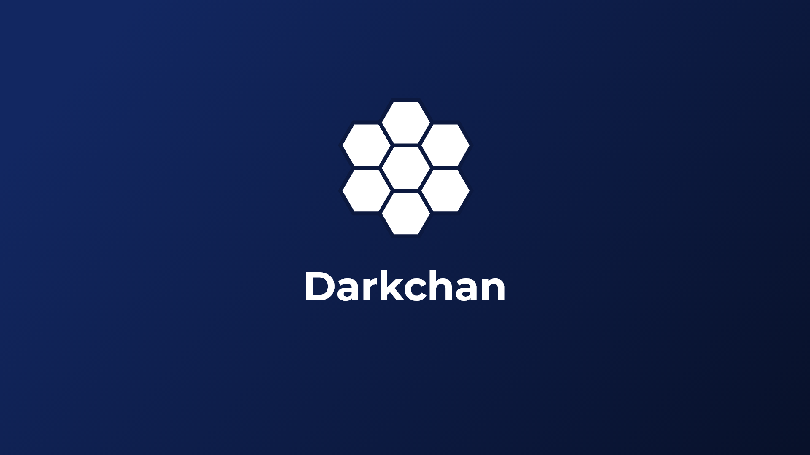

 # **4chan clone 😁, Darkchan 😈**
 #### Darkchan is a Laravel 4chan clone with a modren look.

 One of the things that I love about 4chan is how old and nostalgic it looks, But I wanted to try to redesign it with a modren look 😁.

## **Install**
--------------------

1- Clone or download the project

2- Run    

```bash
php artisan migrate
```

3- Run for dump data (Optional)

```bash
php artisan db:seed
```

4- Make sure that you assign `is_owner` to `true` for your account to give it full access to the website. You can do that using `tinker`

### **Roles**
- **Owner**
    * Can create, read, update and delete all bords, threads and comments
    * Can make users admin for boards
- **Admin**
    * Can create, read , update and delete all threads and comment in authorized boards.
- **User**
    * Can create, read and delete threads and comments using associated password or if the user is logged in will not need a password.


**What I learned from it 😊**

- [x] Using Google recaptcha
- [x] Making small images copy for small sizes using `intervention/image` liberary
- [x] Giving usres access to password protected resources


### **Tools, Framworks And Libraries**
--------------------------------------
1. Design
    * Adobe XD
    * Illustrator (for the logo)
2. Backend
    * Laravel
    * intervention/image
3. Frontend
    * Gulp
    * SASS
    * Bootstrap
    * Fontawesome


## **Screenshots**
--------------------

### **Logo**


### **Home**


### **Boards**


### **Login**


### **Borad**


### **Thread**


See the design on 
[Behance](https://www.behance.net/gallery/92796147/Darkchan)

Video preview for the website [Vimeo](https://vimeo.com/user108744720/review/393610998/00e7e8de80)

My
[Twitter](https://twitter.com/MrMohamed98) | 
[Linkedin](https://www.linkedin.com/in/mohamed-abdallah-b731b61a2/)